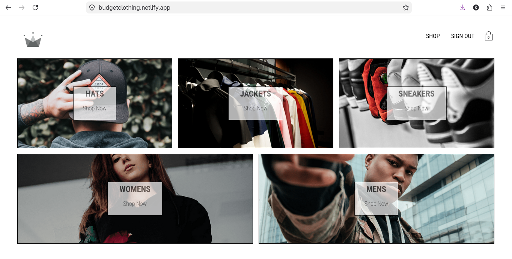
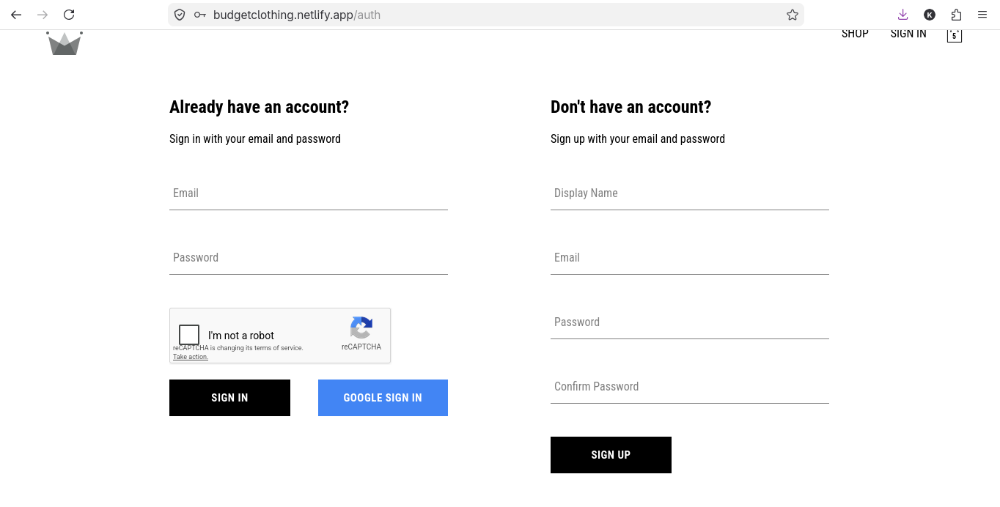
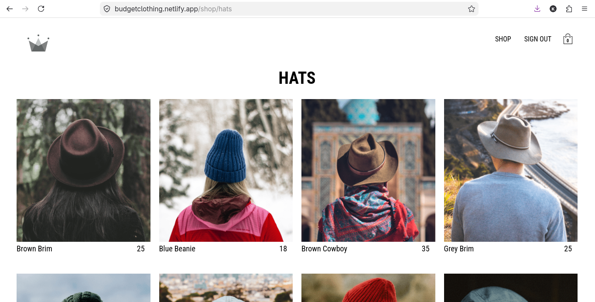
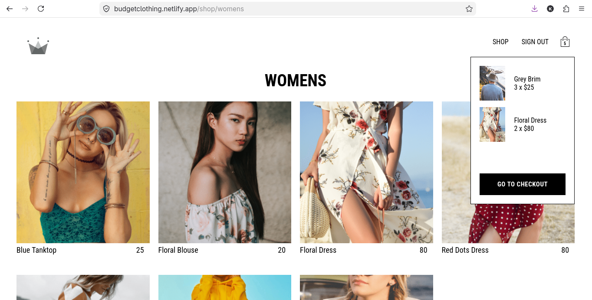
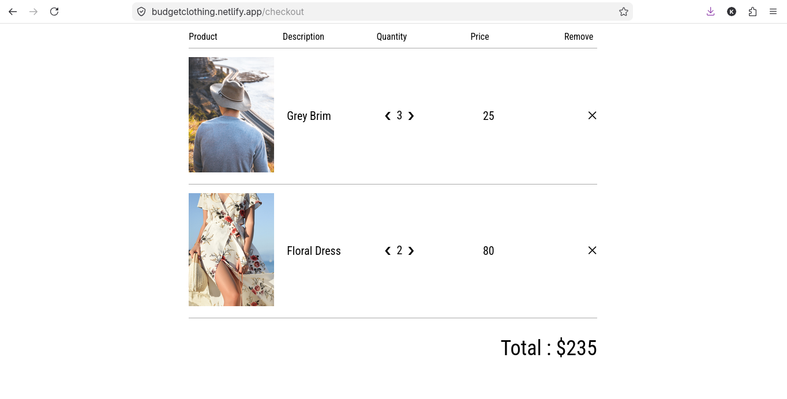
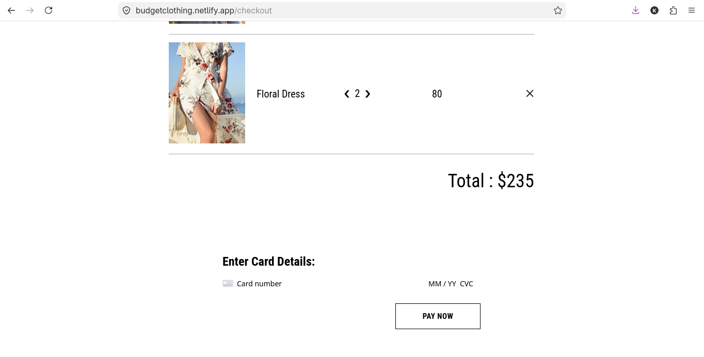

# Budget Clothing 🛍️

A full-stack e-commerce web app for browsing and purchasing clothing by category — built with React, TypeScript, and Firebase.

**🔗 Live demo:** [budgetclothing.netlify.app](https://budgetclothing.netlify.app/)

<!-- Add 1-2 screenshots or a short GIF here once ready, e.g.: -->
 
 
 
 
 
 


## Features

- **Authentication** — New users can sign up, returning users sign in, with bot protection (reCAPTCHA) on login. Built with Firebase Authentication.
- **Category filtering** — Browse clothing by category (Hats, Women's, Men's, Jackets, Sneakers) and add items directly to cart.
- **Live cart** — Cart updates in real time as items are added.
- **Checkout flow** — Review all cart items, adjust quantities or remove items, and see the running total calculated automatically. Supports card payment.

## Tech Stack

- **Frontend:** React, TypeScript — chose TypeScript to catch bugs at compile time rather than runtime, especially around cart and checkout state (item quantities, prices, totals) where a type error could silently produce a wrong total.
- **Styling:** CSS
- **Database:** Firestore — stores product data (categories, prices, stock) with real-time reads for the catalog and filtering.
- **Authentication:** Firebase Authentication — handles sign up, sign in, and session management.
- **Payments:** Stripe — processes card payments at checkout.
- **Serverless functions:** Netlify Functions — server-side logic for Stripe payment processing, keeping API keys off the client.
- **Hosting:** Netlify

## Getting Started

Clone the repo and install dependencies:

```bash
git clone https://github.com/Kendi-prog/budget-clothing.git
cd budget-clothing
npm install
```

Add your Firebase config to a `.env` file (see `.env.example` if available):

```
REACT_APP_FIREBASE_API_KEY=your_key_here
REACT_APP_FIREBASE_PROJECT_ID=your_project_id
REACT_APP_STRIPE_PUBLISHABLE_KEY=your_stripe_publishable_key
...
```

Run the app locally:

```bash
npm start
```

Open [http://localhost:3000](http://localhost:3000) to view it in the browser.

## What I'd Improve Next

- Add order history for logged-in users
- Add search functionality alongside category filters
- Write tests for the checkout calculation logic

## Author

**Kendi** — [GitHub](https://github.com/Kendi-prog)
